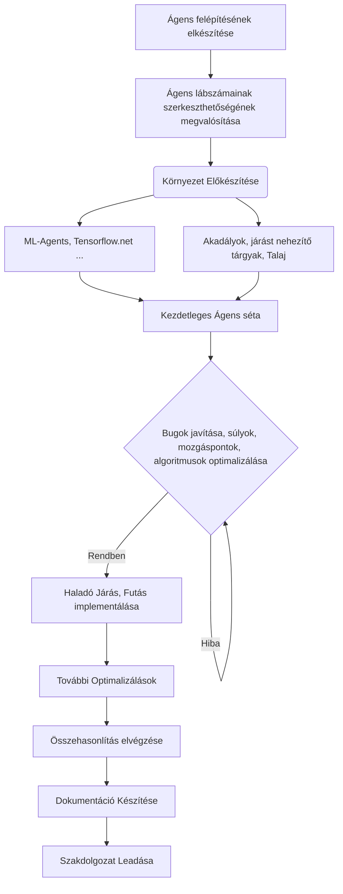

# 2025-26_Egressy_Andras_Szakdolgozat_RL_vs_EVOLUTION

### Szakdolgozat vagy diplomamunka téma címe
  Evolúciós és tanuló algoritmusok összehasonlítása.
### Témavezető neve
  Dr. Horváth Géza
# 
### A téma általános leírása
  
  Az evolúciós és a megerősítéses tanuló algoritmusok is önfejlesztő szoftverek. Ugyanakkor, az evolúciós algoritmusok az evolúciót próbálják lemásolni, míg a megerősítéses tanuló algoritmusok súlyokat használnak a fejlődéshez. Míg előbbi tevékenysége átlátható és tetszés szerint megváltoztatható, ha más döntést szeretnénk egy adott szituációban, utóbbi módszer úgynevezett fekete doboz elven működik, az emberek számára nem tudható, hogy mikor mit miért csinál a rendszer, így nem lehet azt befolyásolni sem. Szemmel láthatólag az emberiség szempontjából sokkal hasznosabb olyan rendszerek alkalmazása, melyek átláthatóak és kontrollálhatóak. Ezért fontos megtudni, hogy mely esetekben működnek hasonló hatékonysággal az evolúciós algoritmusok és a tanuló algoritmusok, és minden ilyen esetben az evolúciós megoldást választani. A szakdolgozat célja, hogy kiválasztunk egy olyan problémát, ahol a megoldó algoritmusok hatékonysága jól mérhető, és összehasonlítjuk a fentebb említett rendszerek ezen problémára adott megoldásainak hatékonyságát.
### Szakdolgozat vagy diplomamunka címe
  Tanulási és evolúciós algoritmusok összehasonlítása: páratlan számú végtaggal rendelkező mesterséges ágensek mozgástanulása szimulált környezetben
### Szerző neve
  Egressy András
### Téma általános leírása
  A dolgozat célja a tanulási és evolúciós algoritmusok gyakorlati összehasonlítása szimulált mozgástanulási feladatokon keresztül. A vizsgált ágensek páratlan számú végtaggal rendelkeznek, ami speciális, valóságban ritkán előforduló mozgásminták elsajátítását igényli. A szimuláció Unity játékmotorban készül, a mesterséges intelligencia viselkedése C#-ban implementált állapotalapú rendszerek, viselkedési fák és saját evolúciós algoritmusok segítségével valósul meg.
### Elvégzendő munka és ütemezése havi bontásban
#### Elvégzendő munka
  A szakdolgozat célja a tanulási és evolúciós algoritmusok összehasonlítása egy Unity-ben fejlesztett szimulált környezetben, külső könyvtárak alkalmazásával. Az ágensek páratlan számú lábbal rendelkeznek (pl. 3, 5, 7), így az algoritmusok olyan mozgási minták elsajátítását célozzák meg, amelyek nem szimmetrikus testfelépítéssel rendelkeznek. A vizsgált algoritmusok részben saját implementációk, de külső könyvtárak és eszközök, mint a ML-Agents vagy a TensorFlow.NET is alkalmazásra kerülnek, amelyek elősegítik a tanulási és evolúciós folyamatok gyorsabb implementálását és tesztelését.

#### Ütemezés
1. hónap – Irodalomkutatás és elméleti háttér
Az első hónapban a cél az evolúciós és tanulási algoritmusok elméleti hátterének megismerése. A kutatás kiterjed a genetikus algoritmusokra, megerősítéses tanulásra, viselkedési fákat alkalmazó rendszerekre és az ipari alkalmazásokra. A kutatás során áttekintésre kerülnek a különböző algoritmusok elméleti alapjai, azok erősségei és gyengeségei, valamint a problémák, amelyeket ezen algoritmusok segíthetnek megoldani. A hónap végére meghatározásra kerülnek azok a kulcsfontosságú szempontok (tanulási idő, mozgás minősége, alkalmazkodás), amelyek alapján az algoritmusokat később értékelni fogjuk.
2. hónap – Szimulációs környezet és technológiai előkészítés
A második hónap célja a szimulációs környezet előkészítése. Unity-ben elkészítjük az ágensek testét és lábait, illetve a fizikai alapokat, mint a Rigidbody és a Joint-ok. Emellett a külső könyvtárak (pl. ML-Agents és TensorFlow.NET) alkalmazására kerül sor a gyorsabb és hatékonyabb tanulási folyamatok megvalósítása érdekében. Ebben a hónapban a kutatás a nem szimmetrikus testfelépítéssel rendelkező ágensek mozgásának modellezésére összpontosít. A hónap végére elkészülnek az első alap szimulációk, és tesztelésre kerülnek az alapvető mozgásmechanizmusok.
3. hónap – Algoritmusok kutatása és hibrid megoldások
A harmadik hónapban a különböző algoritmusok kombinálása kerül előtérbe. A kutatás során kiemelt figyelmet kapnak a tanuló és evolúciós algoritmusok különböző alkalmazási lehetőségei, valamint azok hibrid megoldásai, amelyek egyesítik a genetikus algoritmusokat és a megerősítéses tanulást. Ez a hónap a hibrid algoritmusok előnyeinek feltérképezésére, a paraméterek finomhangolására és az optimális megoldások kialakítására összpontosít. A külső könyvtárak alkalmazása ebben a fázisban segít gyorsítani a kísérletezést és az eredmények értékelését.
4. hónap – Fejlesztés és első implementációk
A kutatási fázis eredményeinek tükrében a fejlesztésben a tanulási és evolúciós algoritmusok első implementációja következik. Az algoritmusok alkalmazásához szükséges bemeneti rendszerek, mint a szenzorok és visszajelzések, valamint a mozgás szabályozására szolgáló mechanizmusok is kidolgozásra kerülnek. Az algoritmusok különböző paraméterekkel történő tesztelése mellett a Unity szimulációs környezetében való futtatás biztosítja az első visszajelzéseket.
5. hónap – Tesztelés, optimalizálás és paraméterhangolás
A fejlődés következő lépése a tesztelés és a paraméterek optimalizálása. Az első tesztelési fázisban különböző algoritmusok kerülnek összehasonlításra, figyelembe véve az olyan szempontokat, mint a tanulási idő, a mozgás minősége és a stabilitás. A kutatás során kiderült legjobb paraméterek és a szimulációs eredmények alapján történik az algoritmusok finomhangolása, hogy azok gyorsabbak és pontosabbak legyenek.
6. hónap – Összehasonlító tesztek és kiértékelés
A hatodik hónapban az összehasonlító tesztek kerülnek előtérbe. Az alkalmazott algoritmusok teljesítménye és eredményei mérésre kerülnek. A tesztelési fázis során különböző lábszámú ágensek (3, 5, 7) futnak, és a mozgás minőségét, alkalmazkodóképességét és stabilitását összehasonlítjuk. Az eredmények kiértékelése segít a megfelelő algoritmusok kiválasztásában, és új irányokat adhat a további fejlesztéshez.
7. hónap – Szakdolgozat elkészítése és záró simítások
A záró hónapban a kutatás és a fejlesztés eredményei dokumentálásra kerülnek a szakdolgozatban. A különböző algoritmusok és szimulációs eredmények részletes bemutatása mellett a dolgozatban a használt technológiák és azok alkalmazásának hatékonysága kerül kiértékelésre. A végső simítások elvégzése után a szakdolgozat beadásra kész lesz.

## Folyamatábra, Használt források. 

### Folyamatábra

### Források
  - Blender - https://docs.blender.org/
  - Unity - https://docs.unity.com/en-us
  - ML-Agents package https://docs.unity3d.com/Packages/com.unity.ml-agents%401.0/manual/index.html
  - Tensorflow.net - https://tensorflownet.readthedocs.io/en/latest/index.html
  - Neural Networks - https://shaderfun.com/2024/04/06/neurons-part-1-a-basic-neural-network/
